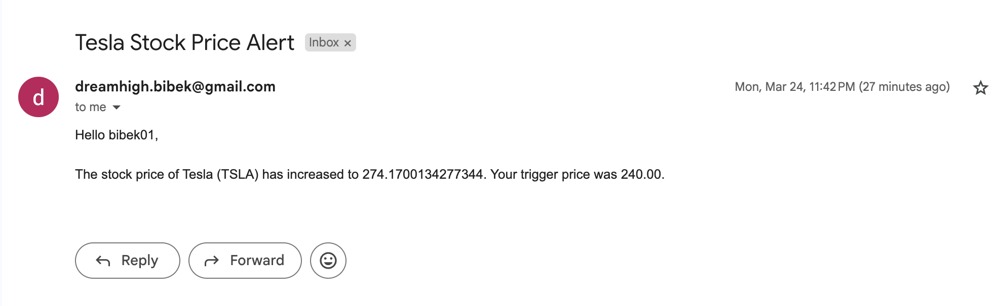

# API Usage

Below are the details for using each API endpoint in the project, including the expected input, request format, and response.

## Swagger Doc:

**Endpoint:** "/swagger"

## 1. User Registration

**Endpoint:** POST "/users/register"

**Description:** Register a new user.

**Request Body:**

```json
{
  "username": "exampleUser",
  "email": "exampleEmail",
  "password": "examplePassword"
}
```

**Response:**

```json
{
  "id": 5,
  "username": "Bibeks1008",
  "email": "Dreamhigh.bibek@gmail.com"
}
```

## 2. User Login

**Endpoint:** POST "/token"

**Description:** Authenticate user and generate a token.

**Request Body:**

```json
{
  "username": "exampleUser",
  "password": "examplePassword"
}
```

**Response:**

```json
{
  "refresh": "refresh_token",
  "access": "access_token"
}
```

## 3. View Stock Prices

**Endpoint:** GET "/view-stocks"

**Description:** Give all available stock prices

**Headers:**
Authorization: Bearer your-auth-token

**Response:**

```json
{
  "status-code": 1,
  "status-message": "",
  "data": {
    "AAPL": 219.47000122070312,
    "MSFT": 392.1400146484375,
    "AMZN": 202.2550048828125,
    "GOOG": 169.44000244140625,
    "NVDA": 121.63999938964844,
    "META": 614.1599731445312,
    "TSLA": 273.8699951171875,
    "BRK-B": 523.010009765625,
    "LLY": 859.47998046875,
    "BRK-A": 784536
  }
}
```

## 4. Add Stock To Track

**Endpoint:** POST "stock-tracking/"

**Description:** Adds stock that user wants to keep track of

**Headers:**
Authorization: Bearer your-auth-token

**Request Body:**

```json
{
  "company": {
    "name": "Tesla",
    "stock_symbol": "TSLA"
  },
  "price_increase_trigger": 240.0,
  "price_decrease_trigger": 200.0
}
```

**Response:**

```json
{
  "status-code": 1,
  "status-message": "",
  "data": {
    "user": 4,
    "company": {
      "name": "Tesla",
      "stock_symbol": "TSLA"
    },
    "price_increase_trigger": "240.00",
    "price_decrease_trigger": "200.00"
  }
}
```

## Description

Api call is made in every 15 minute and if the the stock price of company is above or below the user defined trigger then notification is send.

**Example-Email:**


